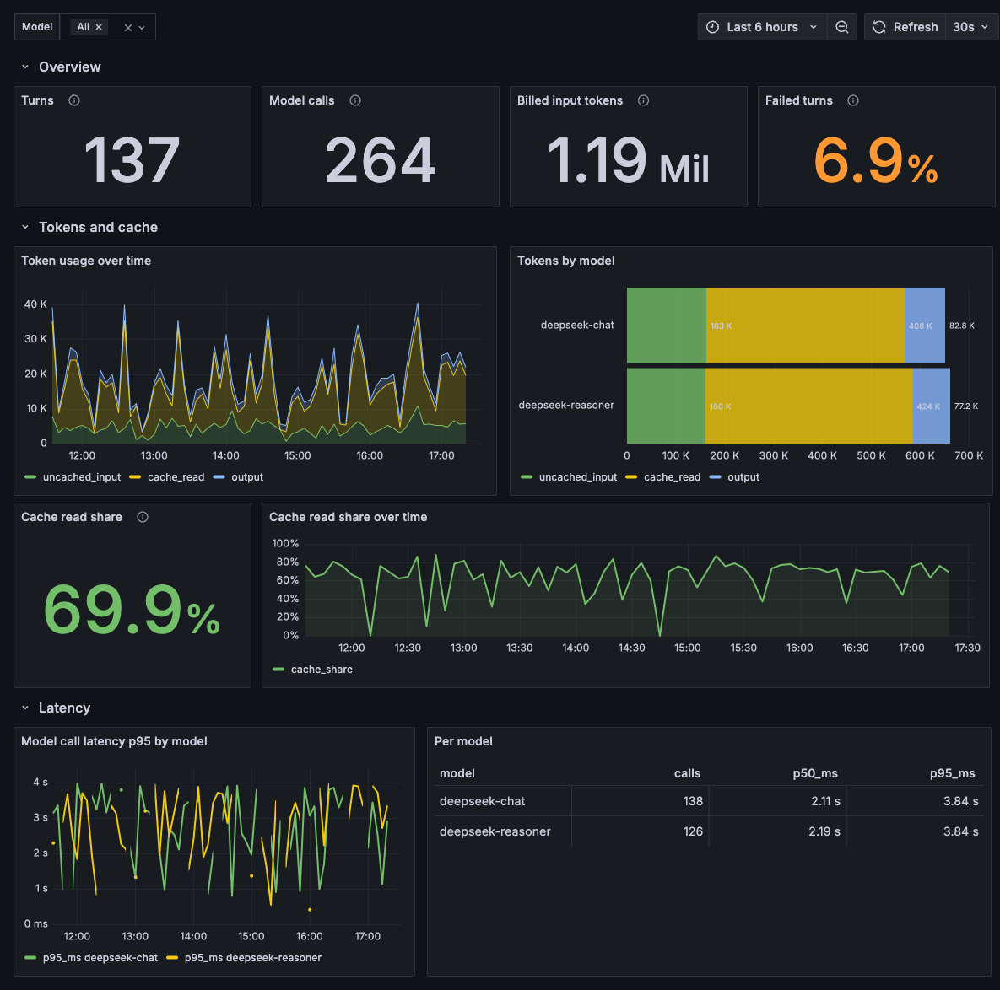
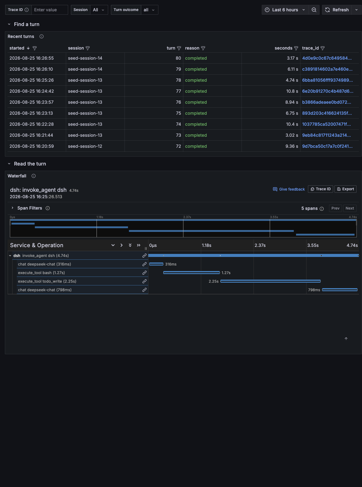

# Grafana dashboards

Four provisioned dashboards over the data `@tma1-ai/dsh-plugin-greptimedb` writes, plus a compose stack that brings up GreptimeDB and Grafana together.





## Run it

```sh
cd grafana
docker compose up -d
open http://localhost:3000
```

Grafana starts with anonymous admin access and both datasources already configured. Point the plugin at `http://localhost:4000/v1/otlp` and the dashboards fill in as the agent runs.

No agent handy? Seed synthetic activity that goes through the plugin's own recorder, so what lands is identical to a real session:

```sh
node grafana/seed.mjs --turns 80
```

## The dashboards

| Dashboard | Answers |
|---|---|
| **DSH · Overview** | What did this cost, how fast was it, how much came from cache |
| **DSH · Agent loop** | Which tools ran, how often they failed, how many model calls a turn needed |
| **DSH · Trace explorer** | What happened inside one specific turn, span by span |
| **DSH · Log explorer** | Every session event, filterable by session, type, and full-text body search |
| **DSH · Metrics** | The same activity read through PromQL, for the retention and sampling reasons below |

Overview and Agent loop are the two you leave open. Trace explorer and Log explorer are where you go once something looks wrong.

Metrics covers what traces cannot: they outlive a shorter trace retention, stay whole under trace sampling, and give percentiles from histogram buckets instead of a scan over every span. Its data points carry the time they were collected, not the time of the events they count, so a replay of historical events shows up at replay time.

Every table links onward: a trace id opens that turn's waterfall, a session id jumps between the trace and log views.

### Why a turn's spans are siblings

The waterfall shows `invoke_agent dsh` with `chat` and `execute_tool` spans directly beneath it, not tools nested inside the model call that requested them. That mirrors the loop: DSH appends `assistant/message` and *then* runs the tools. Nesting would place every tool span entirely after its parent ended.

## Datasources

Two, because they do different jobs:

- **GreptimeDB** (`mysql`) — GreptimeDB speaks the MySQL wire protocol, so Grafana's built-in datasource reads it with nothing to install. Every SQL panel uses this. Two things to know when editing a query: column names containing dots need backticks, and a Postgres-style interval literal (`INTERVAL '5 minutes'`) is rejected over this protocol even though GreptimeDB's HTTP API accepts it. Use a cast — `date_bin('5 minutes'::INTERVAL, timestamp)` — or the MySQL spelling `INTERVAL 5 MINUTE`.
- **GreptimeDB-Traces** (`info8fcc-greptimedb-datasource`) — GreptimeDB's own plugin, installed by the compose file. Only it can turn the trace table into Grafana's trace model, which is what the waterfall needs.

## Verifying the panels

```sh
node grafana/verify.mjs
```

It runs every panel's query through Grafana and reports failures and empty results. A dashboard is only "works out of the box" if its queries parse against the live schema — and GreptimeDB creates a column per attribute it has actually seen, so a panel reading an attribute nothing has written yet fails at plan time rather than returning zero.

That is why `seed.mjs` includes turns killed mid-flight: without them the `dsh.span.unclosed` column never exists and the "Spans without an end event" panel cannot run.

## Indexing

The tables are created by GreptimeDB on first write. The trace table arrives well-tuned (low-cardinality `service_name` as primary key, skipping indexes on `trace_id` and `parent_span_id`), but the attribute columns these dashboards filter on have no index. [`indexes.sql`](indexes.sql) adds them; it is idempotent and safe to run at any point.
